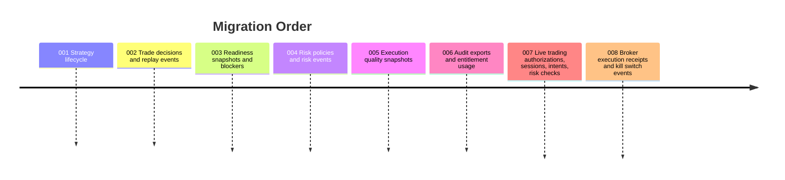

# Premium Live Trading Control Plane

This repository is a premium control plane layered over connected brokers. It supports linked-broker execution workflows, supervised strategy automation, readiness scoring, risk gates, audit replay, and execution-quality evidence. It does not provide custody, clearing, statements, SIPC membership, or broker-dealer operation.

## Layers

1. Connected execution lane
   - Existing broker adapters in `backend/services/execution/`.
   - Linked account, balance, route, and connected-broker receipt abstractions.
   - Live provider submission remains gated by configuration and service checks.

2. Control plane
   - Strategy lifecycle, readiness, risk, audit, execution analytics, and live controls.
   - Live tables are added in Alembic `007_live_trading_core` and `008_live_execution_controls`.
   - Signal generation is separated from live order submission by `TradeDecision`, `LiveOrderIntent`, `LiveRiskCheck`, approval, receipt, and audit records.

3. Product layer
   - React routes for strategies, risk, audit replay, execution quality, live console, live strategy control, and live approvals.
   - Live UI copy is framed around controlled automation and evidence, not promised performance.

## Migration Order

## Connected Broker Boundary

Connected brokers handle custody, accounts, execution, statements, and regulatory brokerage functions. The desk handles strategy lifecycle, readiness scoring, user authorization, risk controls, live order approval, audit replay, and execution-quality evidence.

The product should be positioned as controlled live automation software, not a low-cost broker API or brokerage replacement. Any future business change that would make the company act as a broker-dealer requires qualified legal and compliance review before it is offered.

Official checklist inputs:
- SEC broker-dealer registration guide: https://www.sec.gov/about/divisions-offices/division-trading-markets/division-trading-markets-compliance-guides/guide-broker-dealer-registration
- FINRA Form NMA notice: https://www.finra.org/rules-guidance/notices/26-09
- FINRA membership time frames: https://www.finra.org/rules-guidance/rulebooks/publication/how-become-member-membership-application-time-frames
- SIPC member-firm materials: https://www.sipc.org/for-members/
