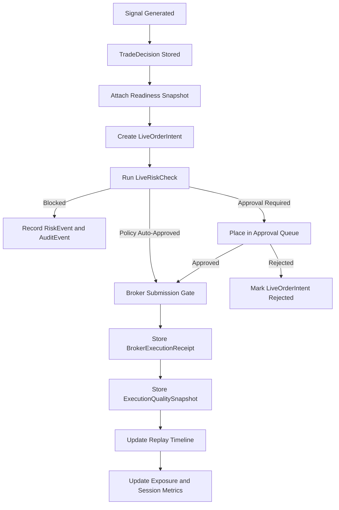

# Live Trading Flow

Real money trading is explicit, reversible, logged, limited, and risk-gated.

Current implementation notes:
- Live order intents are approval-required by default.
- Policy auto-approval is only considered when the active risk policy sets `allow_policy_auto_approval=true` and Professional+ live entitlements are present.
- Broker submission is still blocked unless `FEATURE_LIVE_TRADING=true`, a provider live flag such as `ALPACA_LIVE_TRADING_ENABLED=true`, signed authorization, readiness, risk, session, kill-switch, fresh-data, and audit gates all pass.
- The approval service records a broker receipt even when submission is not performed, so the platform can prove why no broker call occurred.

Live states:
- `draft`
- `paper`
- `validated`
- `live_candidate`
- `armed`
- `live`
- `paused`
- `blocked`
- `killed`
- `retired`

`armed` means the strategy is authorized and ready for explicit start. It does not submit orders.
