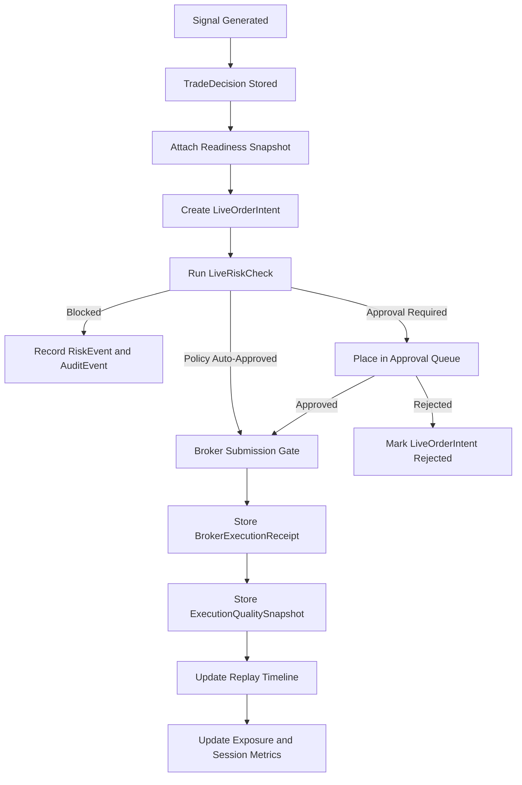

# Live Trading Flow

Real money trading is explicit, reversible, logged, limited, and risk-gated.

Current implementation notes:
- Live order intents are approval-required by default.
- Policy auto-approval is only considered when the active risk policy sets `allow_policy_auto_approval=true` and Professional+ live entitlements are present.
- Broker submission is still blocked unless `FEATURE_LIVE_TRADING=true`, a provider live flag such as `ALPACA_LIVE_TRADING_ENABLED=true`, signed authorization, readiness, risk, session, kill-switch, fresh-data, and audit gates all pass.
- The approval service records a broker receipt even when submission is not performed, so the platform can prove why no broker call occurred.

## Paper-To-Live Proof Gate

This gate is documentation and review discipline only. It does not enable live trading, change broker routes, alter order submission, loosen risk gates, clear kill switches, grant AI order authority, or let analytics change ranking weights.

Current default posture:

- Alpaca paper remains the only unattended execution lane.
- Live-money autonomy remains disabled.
- Paper-to-live readiness remains blocked until a separate future project explicitly reviews and approves it.
- Research, benchmark, reward, forecast, shadow, and promotion outputs remain decision support only.

Minimum evidence required before any future paper-to-live review:

| Gate | Required evidence | Must still be false |
| --- | --- | --- |
| Safety | Kill switches, loss locks, route locks, risk gates, audit trail, and support sanitization are verified. | AI order authority, risk-gate bypass, kill-switch bypass |
| Data | Forward returns, baselines, forecast actuals, spread, slippage, fill delay, route evidence, and regime labels are complete enough for review. | Simulation evidence merged into observed evidence |
| Benchmark | Baseline-relative outcomes, score buckets, after-cost rewards, and insufficient-evidence handling are visible. | Proven-alpha claim, guaranteed-return claim |
| Walk-forward | Frozen out-of-sample experiments exist and no mid-test mutation occurred. | Repeatability claim without tested folds |
| Execution quality | Paper fills link to candidates, quotes, routes, receipts, reconciliation, and cost-adjusted outcomes. | Broker-route loosening, automatic route changes |
| Portfolio risk | Exposure, concentration, liquidity, drawdown, stress, and candidate context are visible. | Automatic risk-limit changes |
| Human approval | A human-readable approval packet exists with rollback plan, hard caps, no leverage, and money-at-risk acknowledgement. | Autonomous live-money orders |

The first acceptable future live test, if ever approved, is a tiny manual live ticket with strict caps, no leverage, and explicit human approval. It is not a live trading feature in the current system.

Blocked claims until every required gate is complete:

- `live_trading_readiness`
- `paper_to_live_readiness`
- `autonomous_money_manager`
- `proven_alpha`
- `repeatability_claim`
- `institutional_grade`
- `hft_capability`

Stop conditions for any future paper-to-live review:

- Any broker route change is required before proof is clean.
- Any order submission logic change is required before proof is clean.
- Any risk gate must be weakened, bypassed, or made advisory.
- Any kill switch needs automatic clearing.
- Any AI component would place, approve, or size orders.
- Any analytics output would mutate ranking weights automatically.
- Any support bundle or report would expose secrets, broker records, account identifiers, raw logs, raw local paths, or credentials.

Live states:
- `draft`
- `paper`
- `validated`
- `live_candidate`
- `armed`
- `live`
- `paused`
- `blocked`
- `killed`
- `retired`

`armed` means the strategy is authorized and ready for explicit start. It does not submit orders.
